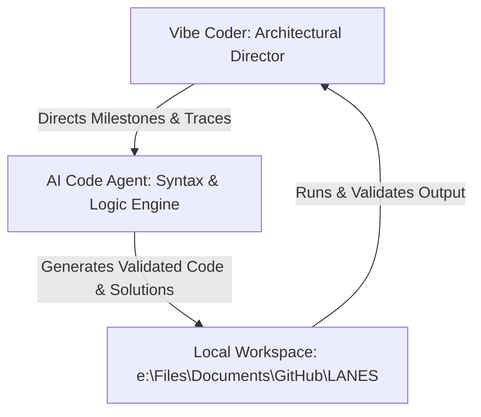
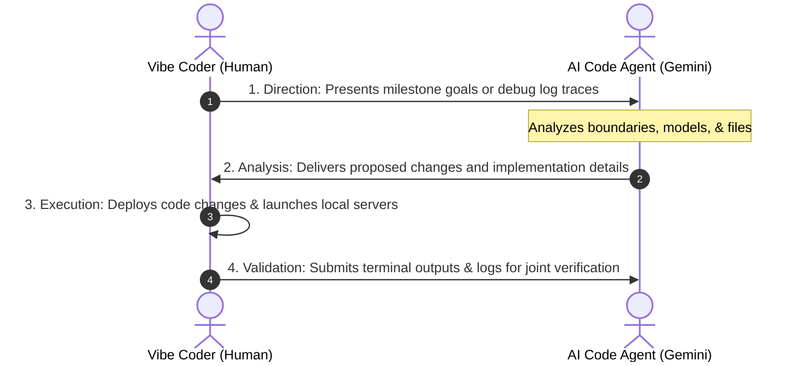

# LANES Development Engine: Agent Roles & Collaboration Protocol

This document establishes the collaborative framework for the development of **LANES (Localised Alternative Navigation for Environs under Submersion)**. It defines the responsibilities, operational boundaries, and iterative development loop between the Human Developer and the AI Code Agent.

> [!IMPORTANT]
> When executing tasks, the AI Agent must also conform to the architecture in [`DESIGN.md`](file:///e:/Files/Documents/GitHub/LANES/DESIGN.md) and the coding/syntax guidelines in [`STANDARDS.md`](file:///e:/Files/Documents/GitHub/LANES/STANDARDS.md).

---

## 1. The Collaboration Concept: Inside-Out Vibe Coding Loop

Development is driven by a tight, iterative loop:
* **Engineering Strategy and Quality Control** are directed by the human developer, focusing on UX validation, high-level structural decisions, and operational flow.
* **Implementation Details** (syntax, parsing, DB models, API constraints, and typing) are automated by the AI Code Agent, ensuring clean, production-ready, and defensively coded configurations.

---

## 2. Team Member Definitions

### 🛠️ Member A: The Vibe Coder (Human Developer)
* **Role:** Architectural Director, Principal Validator, & Product Owner.
* **Operational Scope:**
  * Directs high-level milestones, feature integration orders, and research guidelines.
  * Manages local terminal execution environment, server lifecycles (`uvicorn`, `npm run dev`), and Docker instances.
  * Reviews system interactions, maps, UI responsiveness, and tests edge-case behaviors via browser clients.
* **Style:** High-level prompting, system steering, and verification via visual mapping and API dashboards.

### 🤖 Member B: The AI Code Agent (Gemini Core Engine)
* **Role:** Chief Software Engineer, Syntax Specialist, & Security Auditor.
* **Operational Scope:**
  * Writes production-ready code (Next.js/TypeScript frontend, FastAPI/Python backend, SQLAlchemy ORM, and PostGIS queries).
  * Designs schemas, ensures database normalization (up to 3NF), and constructs secure role permissions.
  * Implements defensive error boundaries (e.g. database-offline fail-safes).
  * Researches errors, analyzes logs, and generates exact code diffs.
* **Style:** Technically exhaustive, defensively written, typed schemas, and structured scannability.

---

## 3. Operational Iteration Protocol

The development workflow operates under a strict four-step loop:

1. **Direction:** The Vibe Coder sets the focus area (e.g. "Migrate to Google Maps API") and provides any necessary environmental context or logs.
2. **Analysis:** The AI Agent inspects the current repository state, maps the flow, and provides the exact file modifications required.
3. **Execution:** The Vibe Coder updates the workspace files and runs the relevant servers (`uvicorn` backend, Next.js frontend, Postgres DB).
4. **Validation:** The Vibe Coder inspects the results (via browser maps, console logs, or Swagger docs) and shares feedback to verify correctness before closing the milestone.

---

## 4. Engineering Principles

The AI Agent must:
* **Prefer maintainability over cleverness.** Avoid unnecessarily complex code structures when simple ones will suffice.
* **Follow SOLID principles** for object-oriented design and component structure.
* **Follow DRY (Don't Repeat Yourself) principles** to minimize redundant implementations.
* **Follow KISS (Keep It Simple, Stupid) principles** to keep interfaces and logic straightforward.
* **Prefer explicit code over implicit behavior** (e.g. use clean typing, schema definitions, and comments).
* **Favor readability over micro-optimizations** unless a specific bottleneck is identified.
* **Minimize technical debt** by writing clean, modular code.
* **Generate production-ready code** including appropriate error boundaries, type checks, and docstrings.

---

## 5. Repository Inspection Rules

Before proposing any code changes:
1. **Read all related files** fully to capture all dependencies and structures.
2. **Understand existing architecture** and design patterns in place.
3. **Follow existing naming conventions** (e.g., camelCase vs snake_case, directories, databases).
4. **Preserve current patterns** (e.g., matching the style of existing API routers or components).
5. **Minimize modifications** to avoid introducing unrelated issues.
6. **Never rewrite functioning modules** unless explicitly requested by the Vibe Coder.

---

## 6. Design & Coding Standards Authority

* [`DESIGN.md`](file:///e:/Files/Documents/GitHub/LANES/DESIGN.md) is the architectural source of truth.
* [`STANDARDS.md`](file:///e:/Files/Documents/GitHub/LANES/STANDARDS.md) is the coding standards and conventions source of truth.

The AI Agent must:
* **Follow all architecture decisions** defined in `DESIGN.md`.
* **Adhere strictly to all syntactic, database, language, and API standards** defined in `STANDARDS.md`.
* **Never introduce technologies** not defined in `design.md` without explicit approval.
* **Never alter database architecture** (schemas, fields, relations) without approval.
* **Never replace mapping, NLP, or routing technologies** without approval.

---

## 7. Response Format

For every implementation request, the AI Agent must provide:
1. **Problem Analysis:** A clear diagnosis of the goal or issue.
2. **Root Cause:** Explanation of why the bug occurs or why the feature requires specific alterations (if debugging).
3. **Proposed Solution:** Architectural breakdown of how the changes will be executed.
4. **Files Affected:** Clickable list of files to modify or create.
5. **Code Changes:** Explicit diff blocks or new code structures.
6. **Risks:** Potential breaking changes, security vulnerabilities, or performance costs.
7. **Validation Steps:** Step-by-step instructions to verify the changes manually or through tests.

---

## 8. GIS Development Rules

The AI Agent must:
* **Validate SRIDs** before performing any spatial queries or operations (default is `SRID 4326` for GPS coordinates).
* **Use PostGIS-native spatial functions** (e.g. `ST_Intersects`, `ST_Buffer`, `ST_DWithin`) directly to leverage Postgres geometry index performance.
* **Prefer indexed spatial queries** by ensuring geometry columns are indexed using spatial index trees (GIST).
* **Avoid coordinate assumptions** (specifically ensuring proper mapping between longitude/latitude `[lng, lat]` GeoJSON arrays and latitude/longitude `[lat, lng]` map API formats).
* **Preserve route calculation accuracy** by checking full line vectors rather than single points for route hazards.
* **Consider flood avoidance zones as critical routing constraints** that force route deflections.

