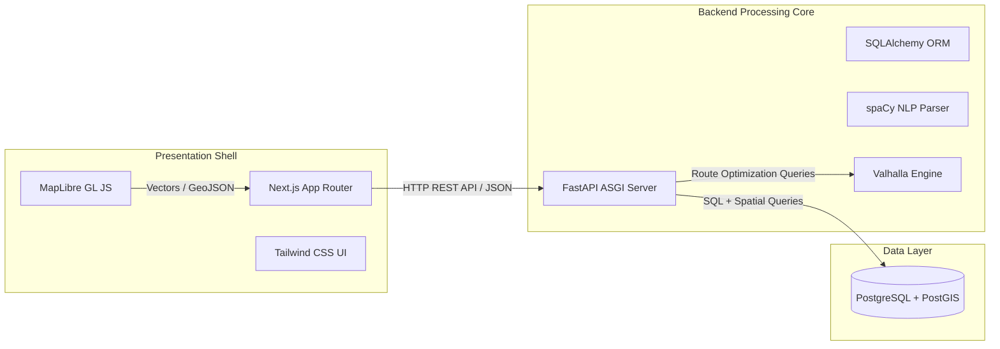
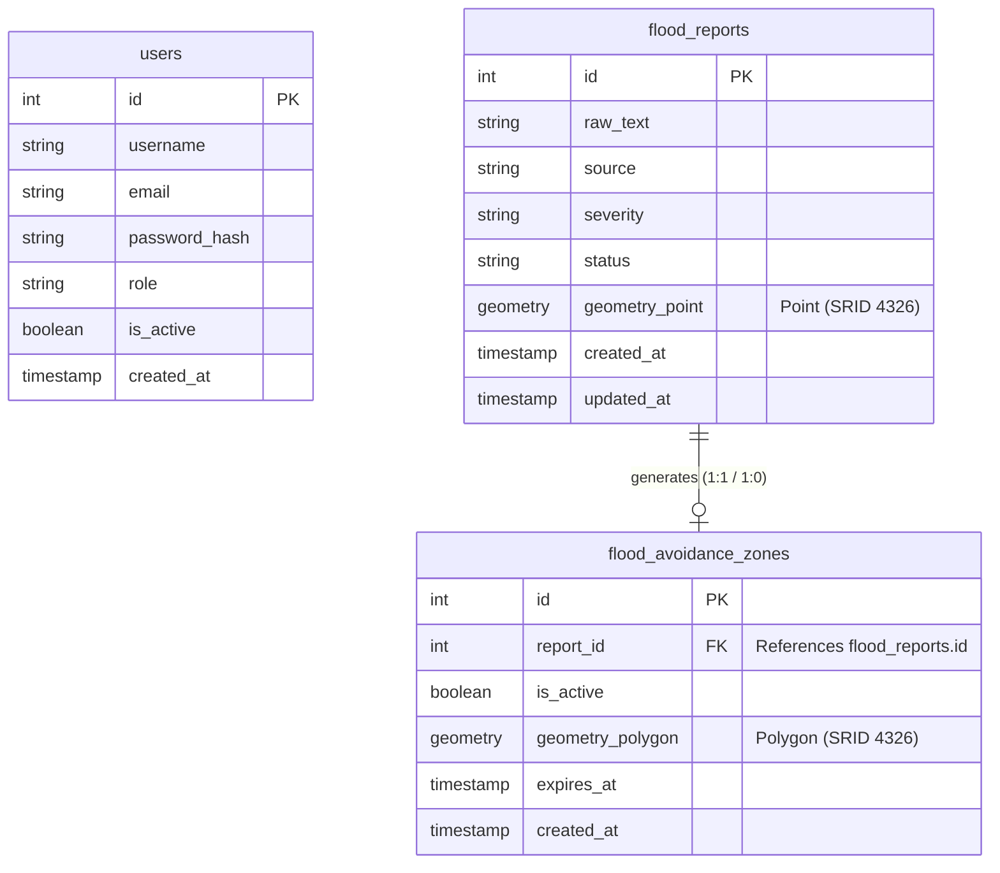
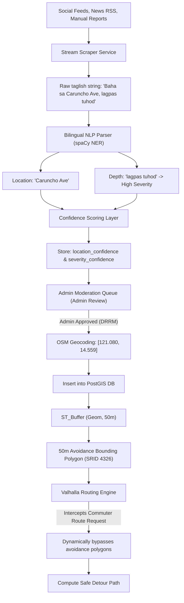
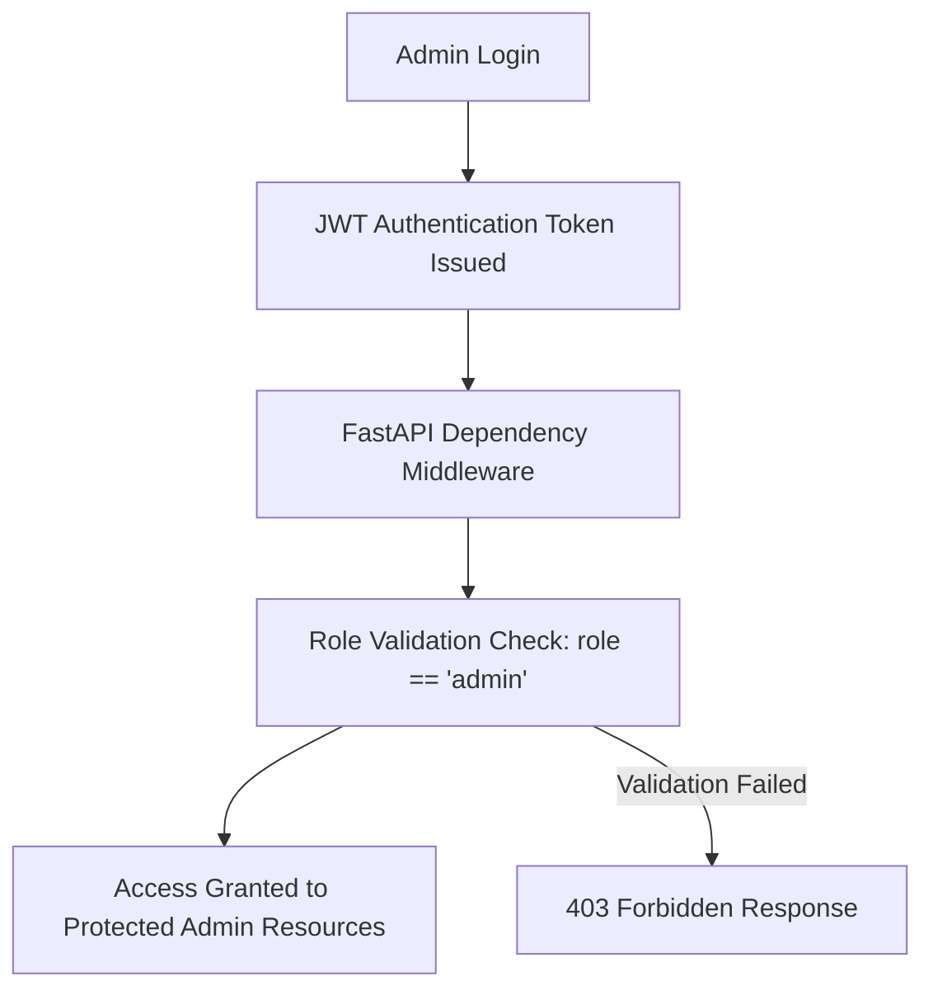

# LANES: Flood-Adaptive Route Calculation Platform
## System Design & Architecture Documentation

LANES (Localised Alternative Navigation for Environs under Submersion) is an intelligent, real-time routing platform that dynamically computes safe transit vectors in Pasig City by converting unstructured bilingual flood reports into spatial database barriers.

> [!IMPORTANT]
> Code implementations of this design must strictly conform to the coding standards and operational rules defined in [`AGENTS.md`](file:///e:/Files/Documents/GitHub/LANES/AGENTS.md).

---

## 1. High-Level Architecture (Three-Tier Decoupled Model)

The platform utilizes a strictly decoupled, three-tier architecture designed to isolate client-side rendering from resource-intensive spatial computations, NLP tokenization, and route planning.



### A. Frontend Presentation Shell (`frontend`)
* **Framework:** Next.js (App Router, Client-Side Rendering).
* **Styling Framework:** Tailwind CSS for responsive layouts.
* **Mapping Engine:** MapLibre GL JS utilizing client-side WebGL vector pipelines.
* **Iconography:** Lucide React for consistent, lightweight vector-style SVG icons.
* **Role:** A stateless, interactive spatial dashboard showing the commuting canvas, placing start/end coordinates, and overlaying flood pins and hazard polygons.

### B. Backend Processing Core (`backend`)
* **Framework:** Python, FastAPI (ASGI server pipeline).
* **Geospatial ORM:** SQLAlchemy paired with GeoAlchemy2 mapping.
* **NLP Processing Stack:** spaCy using a custom-trained Bilingual Named Entity Recognition (NER) pipeline.
* **Routing Compute Engine:** Valhalla native dynamic polygon avoidance.
* **Role:** Handles text ingestion, processes Taglish depth phrases into standardized severity scales, queries coordinate geocodes, and serves route calculations.

### C. Project Directory Structure
* `/frontend`: Next.js application (using **MapLibre GL JS**, **Tailwind CSS**, and **Lucide React**) representing the client maps and admin dashboards.
* `/backend`: FastAPI application (using Python, **spaCy**, **SQLAlchemy**, and **Valhalla**) serving the API routes, spatial database, and NLP pipeline.

---

## 2. Core Database Schema & Relations

The data tier is engineered using PostgreSQL with the PostGIS spatial extension. To prevent write anomalies and ensure academic rigor, the database is normalized up to Third Normal Form (3NF).



### A. Normalization Details (3NF Compliance)
* **First Normal Form (1NF):** Every cell contains atomic values (e.g. separating latitude and longitude into structured GeoJSON arrays or decimal values rather than single comma-separated strings).
* **Second Normal Form (2NF):** Eliminates partial dependencies. All non-key fields (such as `raw_text`, `severity`) depend fully on the primary key `id`.
* **Third Normal Form (3NF):** Eliminates transitive dependencies. All fields inside `flood_reports` are independent of each other and depend solely on the primary key.
* **Scraping Metadata (JSONB):** High-velocity scrapers store variable metadata payloads (e.g. social media profiles, raw API responses) in native `JSONB` columns to ensure structural flexibility without violating normalization constraints.

---

## 3. Data Processing & Spatial Pipeline

The system operates strictly as a software-based solution, avoiding expensive IoT hardware or sensor grids by transforming digital community reports into active geospatial barriers across three computational phases:

```
[ Unstructured Text Ingestion ]
             │
             ▼
  (Phase 1: Bilingual NLP)  ──► Tokenize Taglish & classify depth severity
             │
             ▼
 (Phase 2: PostGIS Buffer)  ──► Geocode & calculate 50m bounding polygon
             │
             ▼
 (Phase 3: Route Rerouting) ──► Pass active polygons to Valhalla for dynamic avoidance
```



### A. AI/NLP Confidence Scoring Layer
To prevent automated ingestion errors and mapping hallucinations, raw reports are filtered through a confidence pipeline before reaching the administration dashboard:
1. **Confidence Ingestion**: The system evaluates text string entities using machine learning weights.
2. **Confidence Storing**: The schema stores two distinct numeric validation metrics for every incoming report:
   * `location_confidence`: Named Entity Recognition (NER) output probability rating (value 0.0 to 1.0) indicating coordinate parsing precision.
   * `severity_confidence`: Regex/Keyword depth mapping density rating (value 0.0 to 1.0) indicating Taglish depth phrase matching precision.
3. **Moderation Flow**: 
   $$\text{NLP Parsing} \longrightarrow \text{Confidence Scoring} \longrightarrow \text{DRRM Admin Review Queue}$$

### B. Standardized Flood Severity & Routing Scale

Flood alerts are classified into four standard safety thresholds based on vehicle clearing heights:

| Tier | Severity | Height Benchmark | Taglish Keywords | Routing Behavior |
| :--- | :--- | :--- | :--- | :--- |
| ⬜ **White** | **Low / Passable** | `10cm` to `20cm` (Ankle-deep) | *basang-basa, bukton* | Passable. No detour required. |
| 🟨 **Yellow** | **Moderate** | `21cm` to `50cm` (Knee-deep) | *tuhod, hanggang-tuhod* | Warning issued. Passable for heavy vehicles. |
| 🟧 **Orange** | **High** | `51cm` to `140cm` (Waist/Chest) | *dibdib, kiwang, bewang* | **Hazardous. Path is avoided in Valhalla.** |
| 🟥 **Red** | **Extreme** | Above `140cm` (Neck-deep / Submerged) | *leeg, lubog, lagpas-tao* | **Impassable. Path is avoided in Valhalla.** |

---

## 4. UI Philosophy: Illustrated Minimalist Spatial System

LANES follows an **Illustrated Minimalist Spatial Design Philosophy**.

The interface is designed for **real-time disaster navigation**, where clarity, speed, and comprehension are more important than visual decoration.

The system combines three layers of design:

### 1. Spatial Truth Layer (Map as Reality)
- The map is the primary source of truth
- All routing, flood data, and hazards are visualized directly on MapLibre GL
- No UI element should obstruct map understanding
- Geographic accuracy is prioritized over visual styling

### 2. Minimal Interaction Layer (UI as Control)
- The interface is intentionally minimal
- Only essential controls are shown (origin, destination, route actions)
- UI components follow a clean, flat, distraction-free design
- No unnecessary navigation menus or decorative elements
- All interactions must be executable within 1–2 steps

### 3. Illustration Interpretation Layer (Meaning & Guidance)
- Illustrations are used to explain system states and complex spatial conditions
- They act as visual translators, not decoration
- Used for:
  - Flood severity explanation
  - System status (loading, offline, no route found)
  - User guidance (how to use the system)
  - Emergency context reinforcement

Illustrations must always support understanding, never distract from map data.

---

## Core Design Principles

### 1. Clarity Under Stress
The interface must remain understandable in emergency situations such as heavy rain, low visibility, or high cognitive load.

### 2. Map-First Experience
The map is the core interface. UI and illustrations exist only to enhance spatial understanding.

### 3. Minimal Cognitive Load
Every screen must be readable within 3 seconds without explanation.

### 4. Illustration-Driven Communication
Complex system states should be communicated visually using simple, consistent vector-style illustrations.

### 5. Fast Interaction Model
All critical actions (route input, recalculation, rerouting) must require minimal steps and immediate feedback.

---

## Visual Hierarchy

1. Map Layer → Primary spatial data (routes, floods, hazards)
2. UI Layer → Controls and navigation input
3. Illustration Layer → Context, meaning, and system state explanation

---

## Design Style Summary

- Style: Illustrated Minimalism
- Layout: Spatial-first (map dominant)
- Components: Minimal, reusable, utility-based (Tailwind)
- Graphics: Simple SVG-based illustrations only
- Emotion: Calm, neutral, informative (not decorative)
- Priority: Speed, clarity, survival-grade usability

---

## Anti-Design Rules (Strict)

- No heavy animations during critical routing
- No decorative-only UI elements
- No cluttered dashboards
- No multi-step forms for emergency actions
- No visual noise that reduces map clarity

---

## 5. Community Feed & Social Validation Architecture

The platform incorporates a dedicated **Community Feed** to provide localized, real-time crowdsourced updates alongside official hazard zones. 

### A. Three-Column Layout Strategy
The Community Feed page is built around a standard desktop Three-Column Layout (which collapses on mobile):
1. **Left Column (Navigation):** Houses main menu links, profile shortcuts, and spatial filters.
2. **Center Column (Main Feed):** A highly performant, virtualized list of community reports. The feed employs a **Tabbed Strategy**:
   - **Nearby:** Utilizes PostGIS distance operators (`<->` and `ST_DWithin`) to rank recent posts strictly by proximity to the user's GPS coordinates.
   - **Recent:** Chronological ordering of the latest city-wide hazard reports.
3. **Right Column (Auxiliary Info):** Contains secondary modules such as Active Weather Alerts, News/Articles, and User Leaderboards.

### B. Crowdsourced Validation (Upvote/Downvote Model)
Rather than standard social media "Likes," interactions serve a strict utilitarian purpose:
* **Upvote:** Signals validation ("I see this flood too" / "Still flooded").
* **Downvote:** Signals inaccuracy or clearance ("Flood has subsided" / "False report").
This creates a self-healing data ecosystem where the community passively moderates hazard validity before or alongside DRRM admin review.

---

## 6. Security & Access Architecture

### A. Principle of Least Privilege (PoLP)
The database enforces strict role separation:
* **Administrative Role (`postgres`):** Restricts database layout alterations, table setup, migrations, and table truncations to migration scripts.
* **Runtime Application Role (`lanes_app`):** Used by the FastAPI backend. Restricted to basic operations (`SELECT`, `INSERT`, `UPDATE`) inside the `public` schema. It cannot execute administrative changes (such as dropping tables).

### B. Idempotent Data Seeding
To allow repeatable testing and predictable map initialization during presentations:
* The seeder script executes `ON CONFLICT DO NOTHING` database directives or resets primary keys via `TRUNCATE ... RESTART IDENTITY CASCADE`.
* This ensures repeated test executions do not create duplicate marker overlays or stack overlapping polygons.

### C. Connection Hardening
* The database authentication layer implements **`scram-sha-256`** password exchange to prevent cleartext credentials leakage.

### D. Authentication Architecture
* **Algorithm:** Passwords are securely hashed using **bcrypt** via the `bcrypt` Python library. Bcrypt incorporates an adaptive cost factor and per-password salting, making it highly resistant to brute-force and rainbow table attacks.
* **Token Issuance:** Successful authentication returns a signed **JWT (JSON Web Token)** generated by `python-jose[cryptography]`. The token carries the user's role and is stored client-side in `localStorage` under the key `lanes_token`.
* **Role Permissions Isolation:** Users are categorized under two primary roles:
  * `commuter`: Standard client access for route calculations, incident displays, and crowd alert broadcasts.
  * `admin` / `drrm`: Administrative privileges for moderating incoming reports and managing active avoidance zones.

### E. Authentication & Authorization Flow
Access to secure administrative endpoints undergoes a multi-layer verification check:



---

## 7. Non-Functional Requirements (NFRs)

To guarantee the platform runs successfully during weather-induced emergency scenarios, the system adheres to the following performance bounds:
* **Latency constraint:** Route calculation and flood bypassing response queries must resolve in **under 3 seconds** under ordinary network conditions.
* **Service Reliability:** Ensure a **99% service availability rate** for the API gateway and routing engines during severe weather events and operational periods.
* **Volume Capability:** The spatial database and routing parser are optimized to support and query **thousands of simultaneous flood reports** without connection pool exhaustion.
* **Fault Tolerance:** Under the decoupled architecture, **the system continues operating despite individual service failures** (e.g. if the database is offline, route requests fall back gracefully to direct routing).

---

## 8. System Constraints & Assumptions

### A. Assumptions
* **Internet Connectivity:** The client dashboard requires a stable internet connection to fetch vector maps and make async API queries to the backend.
* **Map Data Availability:** The OpenStreetMap (OSM) public dataset or Google Maps database services remain online and reachable for geocoding and base mapping.
* **Legible Reports:** Incoming crowd alerts contain recognizable location strings or street tokens that can be mapped to real coordinates.

### B. Constraints
* **Base Map Quality:** Routing safety and coordinates geocoding precision are bound to the underlying layout accuracy of OpenStreetMap/Google Maps network topology.
* **NLP Training Limitations:** Natural Language Processing entity extraction relies on training dataset coverage (specifically Taglish conversational patterns and spelling variants).
* **Geocoder Resolution:** Conversion from text strings (e.g. "Caruncho Ave") to coordinates is limited by the resolution and coverage of local GIS database mappings.

---

## 9. Audit Logging & Moderation Logs

To maintain administrative accountability and track disaster database updates:

> [!IMPORTANT]
> The `audit_logs` table is **planned** and not yet implemented. It will be introduced via an Alembic migration as part of the Admin Panel build (Phase 6 of `docs/admin-panel-plan.md`).

* **`audit_logs`** *(Planned)*: Will track all admin actions in a single unified log — report approvals/rejections, zone deactivations, user management changes, and login events. Each entry will store the `admin_id`, `action_type`, `target_table`, `target_id`, optional `metadata_json` (JSONB), `ip_address`, and `created_at` timestamp. This design combines what was originally scoped as two separate tables (`moderation_logs` + `audit_logs`) into a single, filterable timeline for simplicity and 3NF compliance.
